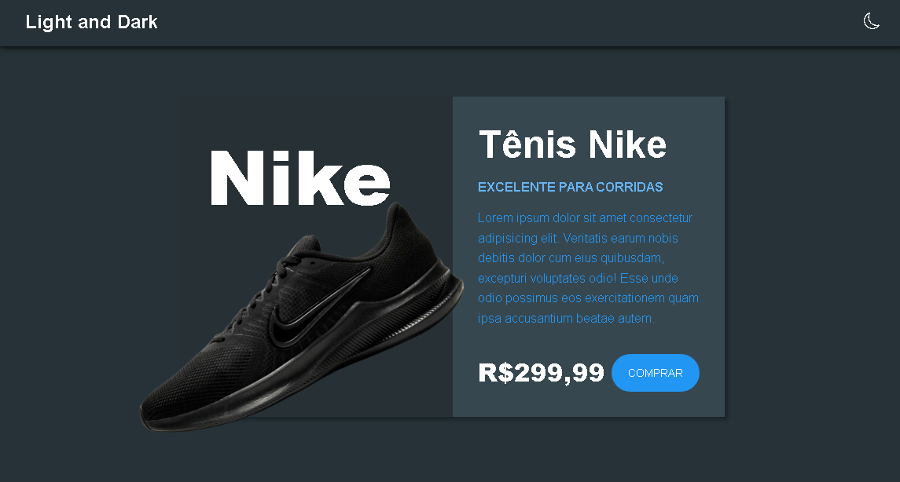
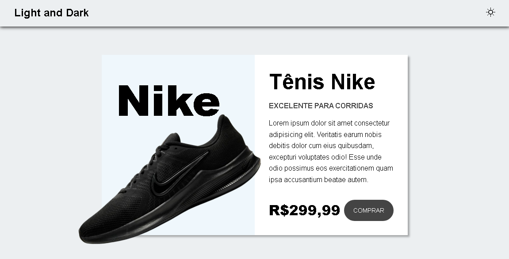

# Dark Mode

<!--  |  -->
---

|dark-mode|light-mode|
|---|---|
|  | 

Projeto dark mode onde o usuário consegue mudar o tema de cores do site para o tema escuro e o tema claro. E o projeto também tem a funcionalidade de salvar a preferência do tema definido pelo usuário usando o localStorage para fazer isso.

Desenvolvido com:

- HTML
- CSS
- JavaScript